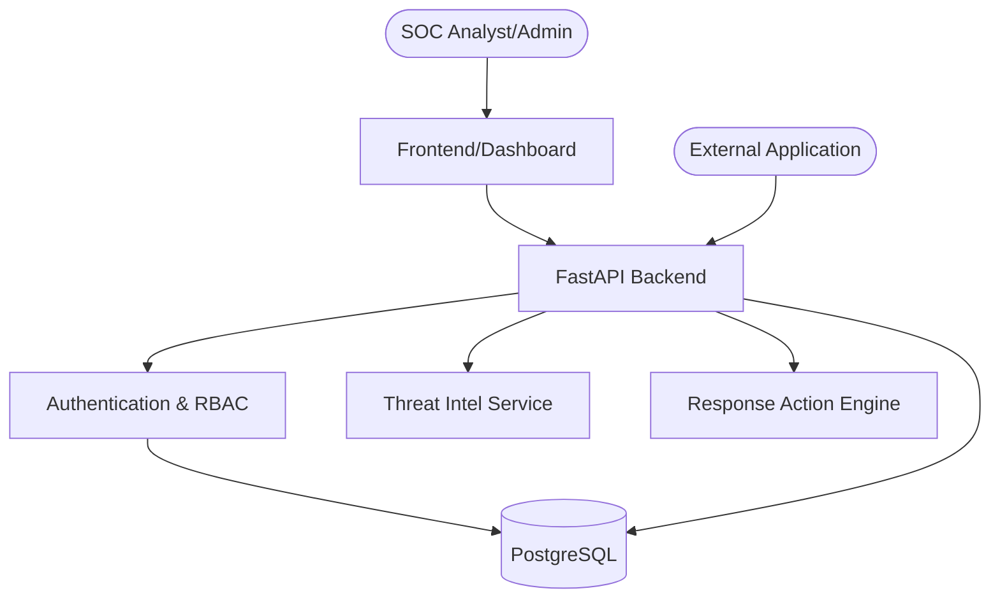

# SentinelSOC Threat Model

This document outlines the main attack surfaces, threats, and mitigations in SentinelSOC.

## Architecture & Attack Surface

## Threat Matrix

| Component | Threat | Impact | Mitigation | Residual Risk |
|---|---|---|---|---|
| **Authentication** | Credential Stuffing / Brute Force | High (Account takeover) | Rate limiting, account lockouts, Argon2 hashing | Low (Shared IP constraints) |
| **Authentication** | JWT Theft / Replay | High (Session hijack) | Short token expiration, Secure HTTPS cookies | Low |
| **API Keys** | API Key Theft | High (Data injection) | Stored as hashes, keys only displayed once | Low |
| **Event Ingestion** | DoS via oversized payloads | High (Service degradation) | `MAX_EVENT_PAYLOAD_BYTES` bounding, JSONB depth limit | Low |
| **Event Ingestion** | Application Impersonation | High (Data pollution) | API key intrinsically linked to `application_id` | Low |
| **Database** | SQL Injection | High (Data leak/corruption) | Parameterized queries (SQLAlchemy ORM) | Low |
| **RBAC / Authz** | Cross-Tenant Data Access (IDOR) | High (Data leak) | `filter_query_by_app_access` limits queries by tenant | Low |
| **Frontend** | Cross-Site Scripting (XSS) | Medium (Client compromise) | React/Next.js sanitization, strict CSP headers | Low |
| **Reports** | CSV Formula Injection | Medium (Client compromise) | Prepended `'` to fields starting with `=,+,-,@` | Low |
| **Response Actions**| Arbitrary Command Execution | Critical (System compromise) | Strict payload validation, required Analyst approval | Low |

## Conclusion
SentinelSOC employs a defense-in-depth approach, prioritizing safe defaults, bounded inputs, and strict tenant isolation. Continuous dependency auditing and rigorous input validation reduce the risk of compromise.
